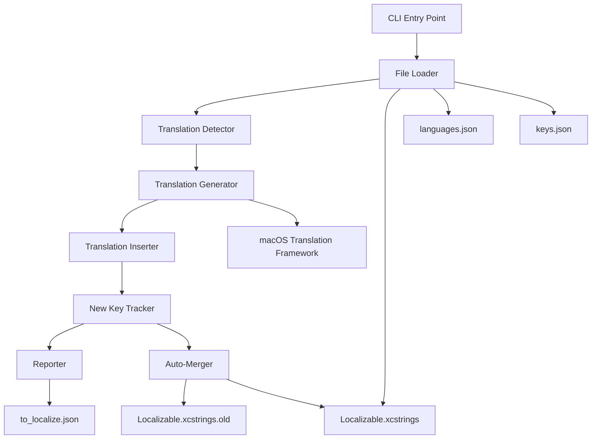
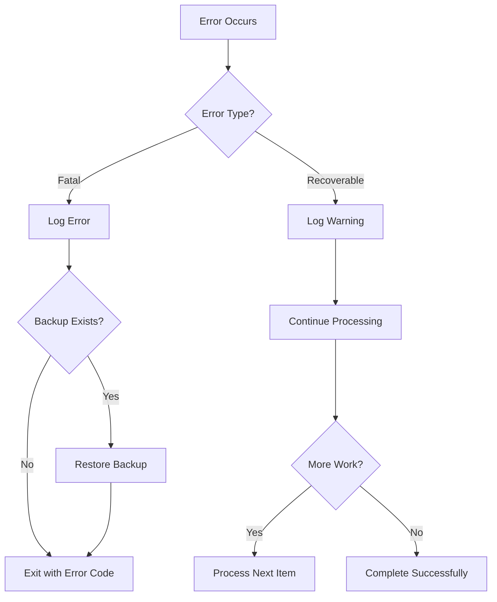

# Design Document: Localization Automation Tool

## Overview

The localization automation tool is a Python command-line script that manages translations for an Xcode localization file (Localizable.xcstrings). The tool processes a large JSON file containing localization keys and their translations across 38 languages, identifies missing translations, generates translations using macOS Translation framework via PyObjC, and manages new localization keys.

The tool operates in two modes:
1. **Analysis mode** (default): Identifies missing translations, generates them, and creates a to_localize.json file with new keys
2. **Auto-merge mode** (--auto-merge flag): Performs analysis, then backs up and merges new keys into the main localization file

Key design principles:
- Preserve existing translations (never overwrite)
- Maintain exact JSON structure of Xcode localization format
- Handle format specifiers and special characters correctly
- Provide clear progress feedback for long-running operations
- Fail gracefully with actionable error messages

## Architecture

The tool follows a pipeline architecture with distinct stages:

```
Load Files → Detect Missing → Generate Translations → Insert Translations → Track New Keys → Report/Merge
```

### Component Diagram



### Data Flow

1. **Input Phase**: Load and validate three JSON files
2. **Detection Phase**: Identify missing translations by comparing existing localizations against language list
3. **Generation Phase**: Use Translation framework to generate missing translations
4. **Insertion Phase**: Add generated translations to in-memory data structure
5. **Tracking Phase**: Identify new keys that need to be added to main file
6. **Output Phase**: Write to_localize.json and optionally merge into main file

## Components and Interfaces

### 1. File Loader Component

**Responsibility**: Load and validate all input JSON files

**Interface**:
```python
class FileLoader:
    def load_localizable(path: str) -> dict
    def load_languages(path: str) -> dict
    def load_keys(path: str) -> dict
    def validate_localizable_structure(data: dict) -> bool
```

**Behavior**:
- Load JSON files with error handling for missing files and invalid JSON
- Validate that Localizable.xcstrings contains required fields: "sourceLanguage", "strings", "version"
- Return parsed dictionaries for downstream processing
- Raise descriptive exceptions for validation failures

### 2. Translation Detector Component

**Responsibility**: Identify missing translations for each localization key

**Interface**:
```python
class TranslationDetector:
    def __init__(localizable_data: dict, supported_languages: list[str])
    def find_missing_translations() -> dict[str, list[str]]
    # Returns: {localization_key: [missing_language_codes]}
```

**Behavior**:
- Iterate through all keys in localizable_data["strings"]
- For each key, check if "localizations" field exists
- Compare existing language codes in "localizations" against supported_languages
- Return mapping of keys to their missing language codes
- Handle keys with empty or missing "localizations" dictionaries

### 3. Translation Generator Component

**Responsibility**: Generate translations using macOS Translation framework

**Interface**:
```python
class TranslationGenerator:
    def __init__()
    def check_framework_available() -> bool
    def translate(source_text: str, target_language: str) -> str | None
    def batch_translate(source_text: str, target_languages: list[str]) -> dict[str, str]
```

**Behavior**:
- Use PyObjC to interface with Translation framework
- Verify framework availability at initialization
- Handle missing language packs gracefully (log warning, return None)
- Preserve format specifiers (%lld, %@, %1$@, %2$@) in translations
- Support batch translation for efficiency
- Return None for failed translations

**Translation Framework Integration**:
```python
# Using PyObjC to access Translation framework
from Foundation import NSBundle
import objc

# Load Translation framework
translation_bundle = NSBundle.bundleWithPath_(
    "/System/Library/Frameworks/Translation.framework"
)

# Access translation APIs
# Note: Actual API may vary based on macOS version
```

### 4. Translation Inserter Component

**Responsibility**: Insert generated translations into the localization data structure

**Interface**:
```python
class TranslationInserter:
    def __init__(localizable_data: dict)
    def insert_translation(key: str, language: str, translated_text: str) -> None
    def get_updated_data() -> dict
```

**Behavior**:
- Modify localizable_data in-place
- Create "localizations" dictionary if it doesn't exist for a key
- Add language entry with proper structure:
  ```json
  {
    "stringUnit": {
      "state": "translated",
      "value": "<translated_text>"
    }
  }
  ```
- Never overwrite existing translations
- Preserve all existing fields and structure

### 5. New Key Tracker Component

**Responsibility**: Identify keys from keys.json that need to be added to Localizable.xcstrings, generate translations for them, and create a fully translated structure

**Interface**:
```python
class NewKeyTracker:
    def __init__(localizable_data: dict, keys_data: dict, generator: TranslationGenerator, supported_languages: list)
    def find_new_keys() -> list[str]
    def generate_translations_for_new_keys() -> dict
    def create_to_localize_structure() -> dict
```

**Behavior**:
- Iterate through keys in keys_data["strings"]
- Check if each key exists in localizable_data["strings"]
- If key doesn't exist OR has zero translations, identify as a new key
- For each new key, generate translations for all supported languages using TranslationGenerator
- Insert generated translations into the new key's structure
- Create output structure matching Localizable.xcstrings format with translations:
  ```json
  {
    "sourceLanguage": "en",
    "strings": {
      "key1": {
        "localizations": {
          "es": {
            "stringUnit": {
              "state": "translated",
              "value": "translated text"
            }
          },
          "fr": { ... }
        }
      },
      "key2": { ... }
    },
    "version": "1.0"
  }
  ```

### 6. Reporter Component

**Responsibility**: Generate summary reports and write output files

**Interface**:
```python
class Reporter:
    def __init__(stats: dict)
    def report_analysis_summary() -> None
    def write_to_localize_file(data: dict, path: str) -> None
    def report_merge_summary(merged_count: int) -> None
```

**Behavior**:
- Track statistics: keys processed, translations added, new keys found
- Print formatted summary to console
- Write to_localize.json with proper indentation (2 spaces)
- Include warnings for missing language packs

### 7. Auto-Merger Component

**Responsibility**: Backup and merge new keys into main localization file

**Interface**:
```python
class AutoMerger:
    def __init__(localizable_path: str)
    def backup_file() -> None
    def merge_keys(to_localize_data: dict) -> int
    def write_merged_file(data: dict) -> None
    def restore_backup() -> None
```

**Behavior**:
- Delete existing .old backup if present
- Copy current Localizable.xcstrings to Localizable.xcstrings.old
- Merge keys from to_localize into main data structure
- Preserve all existing keys and translations
- Write updated file with proper JSON formatting
- Restore backup on error

### 8. CLI Entry Point

**Responsibility**: Parse arguments and orchestrate the workflow

**Interface**:
```python
def main() -> int:
    # Parse arguments
    # Execute workflow
    # Return exit code
```

**Behavior**:
- Parse command-line arguments (--auto-merge, --help)
- Instantiate components in correct order
- Handle exceptions and provide clear error messages
- Return 0 for success, non-zero for errors
- Display progress messages for long operations

## Data Models

### Localizable.xcstrings Structure

**Schema**:
```python
{
  "sourceLanguage": str,  # Always "en"
  "strings": {
    str: {  # Localization key
      "localizations": {
        str: {  # Language code
          "stringUnit": {
            "state": str,  # "translated" or "new"
            "value": str   # Translated text
          }
        }
      }
    }
  },
  "version": str  # Always "1.0"
}
```

**Example** (from actual Localizable.xcstrings):
```json
{
  "sourceLanguage": "en",
  "strings": {
    "": {},
    "%@ theme%@": {
      "localizations": {
        "en": {
          "stringUnit": {
            "state": "new",
            "value": "%1$@ theme%2$@"
          }
        }
      }
    },
    "%lld characters": {},
    "%lld document(s) tagged": {},
    "%lld pt": {},
    "%lld words": {
      "localizations": {
        "de": {
          "stringUnit": {
            "state": "translated",
            "value": "%lld Wörter"
          }
        },
        "es": {
          "stringUnit": {
            "state": "translated",
            "value": "%lld palabras"
          }
        },
        "fr": {
          "stringUnit": {
            "state": "translated",
            "value": "%lld mots"
          }
        },
        "it": {
          "stringUnit": {
            "state": "translated",
            "value": "%lld parole"
          }
        },
        "ja": {
          "stringUnit": {
            "state": "translated",
            "value": "%lld 語"
          }
        },
        "zh-Hans": {
          "stringUnit": {
            "state": "translated",
            "value": "%lld 字"
          }
        }
      }
    },
    "%lldw": {},
    "•": {},
    "+%lld": {},
    "Aa": {},
    "About": {},
    "Actions (%lld)": {
      "localizations": {
        "de": {
          "stringUnit": {
            "state": "translated",
            "value": "Aktionen (%lld)"
          }
        },
        "es": {
          "stringUnit": {
            "state": "translated",
            "value": "Acciones (%lld)"
          }
        },
        "fr": {
          "stringUnit": {
            "state": "translated",
            "value": "Actions (%lld)"
          }
        },
        "it": {
          "stringUnit": {
            "state": "translated",
            "value": "Azioni (%lld)"
          }
        },
        "ja": {
          "stringUnit": {
            "state": "translated",
            "value": "アクション (%lld)"
          }
        },
        "zh-Hans": {
          "stringUnit": {
            "state": "translated",
            "value": "操作 (%lld)"
          }
        }
      }
    }
  },
  "version": "1.0"
}
```

**Key Observations**:
- Some keys have empty dictionaries (no translations yet)
- Some keys have partial translations (only a few languages)
- Format specifiers like %lld, %@, %1$@, %2$@ must be preserved
- Unicode characters (Chinese, Japanese, German umlauts) must be preserved
- The "state" field can be "new" or "translated"

### languages.json Structure

```python
{
  str: {  # Language code (e.g., "de", "es", "zh-Hans")
    "last_update": str  # ISO date string
  }
}
```

### keys.json Structure

```python
{
  "sourceLanguage": str,  # Always "en"
  "strings": {
    str: {  # Localization key
      "last_update": str  # ISO date string
    }
  }
}
```

### to_localize.json Structure

Same as Localizable.xcstrings but only contains keys with zero translations:

```python
{
  "sourceLanguage": "en",
  "strings": {
    str: {}  # Empty dict for each new key
  },
  "version": "1.0"
}
```

### Statistics Model

```python
{
  "keys_processed": int,
  "translations_added": int,
  "new_keys_found": int,
  "missing_language_packs": list[str],
  "translation_errors": int
}
```

## Correctness Properties

*A property is a characteristic or behavior that should hold true across all valid executions of a system—essentially, a formal statement about what the system should do. Properties serve as the bridge between human-readable specifications and machine-verifiable correctness guarantees.*


### Property 1: Missing Translation Detection Completeness

*For any* localization key and any language from the supported languages list, if that language is not present in the key's localizations dictionary (or the dictionary is empty or missing), then the tool should identify that language as requiring translation.

**Validates: Requirements 2.2, 2.3, 2.4, 2.5**

### Property 2: Translation Preservation

*For any* localization key that already has a translation for a given language, after processing the tool should preserve that exact translation without any modification to its value, state, or structure.

**Validates: Requirements 4.3, 4.5, 7.5**

### Property 3: Format Specifier Preservation

*For any* source string containing format specifiers (such as %lld, %@, %1$@, %2$@), the translated output should contain exactly the same format specifiers in the same order, regardless of the target language.

**Validates: Requirements 3.7, 9.6**

### Property 4: Translation Insertion Structure

*For any* generated translation, the inserted data structure should contain a "stringUnit" object with both "state" field set to "translated" and "value" field set to the translated text.

**Validates: Requirements 3.8, 4.1, 4.2**

### Property 5: New Key Identification

*For any* key in the keys.json file, if that key either does not exist in Localizable.xcstrings or exists with zero translations, then it should be identified as a new key and translations should be generated for it.

**Validates: Requirements 5.3, 5.4, 5.6**

### Property 6: Existing Key Exclusion

*For any* key in the keys.json file that exists in Localizable.xcstrings with one or more translations, that key should not be identified as a new key and should not appear in the to_localize.json output file.

**Validates: Requirements 5.5**

### Property 7: Output Structure Validity with Translations

*For any* generated output file (to_localize.json or merged Localizable.xcstrings), the JSON structure should contain exactly the required fields: "sourceLanguage" set to "en", "strings" as a dictionary, and "version" set to "1.0". Additionally, for to_localize.json, each new key should contain translations for all supported languages in the proper stringUnit structure.

**Validates: Requirements 5.8, 5.9, 4.4**

### Property 8: Processing Completeness

*For any* input file, the number of keys reported as processed should equal the total number of keys present in the "strings" dictionary of that file.

**Validates: Requirements 2.1, 5.1**

### Property 9: Reporting Accuracy

*For any* completed analysis, the reported statistics (keys processed, translations added, new keys found) should exactly match the actual counts of those operations performed during processing.

**Validates: Requirements 6.1, 6.2, 6.3, 7.7**

### Property 10: Merge Completeness

*For any* auto-merge operation, all keys present in to_localize.json should appear in the merged Localizable.xcstrings file after the merge completes.

**Validates: Requirements 7.4**

### Property 11: Backup Integrity

*For any* auto-merge operation, the backup file created at Localizable.xcstrings.old should be byte-for-byte identical to the original Localizable.xcstrings file before any modifications.

**Validates: Requirements 7.3**

### Property 12: Error Recovery

*For any* error that occurs during the merge operation, if a backup exists, then the original Localizable.xcstrings file should be restored to its pre-merge state from the backup.

**Validates: Requirements 7.8, 9.7**

### Property 13: Unicode Preservation

*For any* string containing Unicode characters (non-ASCII), those characters should be preserved exactly through all processing stages including loading, translation, and writing.

**Validates: Requirements 9.5**

### Property 14: Source Language Consistency

*For any* translation operation, the source language parameter passed to the Translation framework should always be "en" (English).

**Validates: Requirements 3.3**

### Property 15: Translation Source Text

*For any* localization key being translated, the source text passed to the Translation framework should exactly match the key's text.

**Validates: Requirements 3.4**

### Property 16: Error Resilience

*For any* translation that fails (due to missing language pack or framework error), the tool should log the error and continue processing remaining translations without terminating.

**Validates: Requirements 3.6, 9.1**

### Property 17: Exit Code Correctness

*For any* execution of the tool, if all operations complete successfully without errors, the exit code should be 0; if any error occurs, the exit code should be non-zero.

**Validates: Requirements 8.5, 8.6**

### Property 18: JSON Validation Before Write

*For any* JSON file being written, the tool should validate that the data structure is valid JSON before writing to disk, and should not write the file if validation fails.

**Validates: Requirements 9.3, 9.4**

### Property 19: Input Structure Validation

*For any* Localizable.xcstrings file loaded, the tool should verify that it contains the required fields ("sourceLanguage", "strings", "version") and should report an error and terminate if any required field is missing.

**Validates: Requirements 1.6, 1.7**

### Property 20: Missing File Error Handling

*For any* required input file (Localizable.xcstrings, languages.json, keys.json), if the file does not exist, the tool should report a clear error message identifying which specific file is missing and terminate with a non-zero exit code.

**Validates: Requirements 1.4**

### Property 21: Invalid JSON Error Handling

*For any* input JSON file that contains syntax errors, the tool should report a clear error message identifying which specific file has invalid JSON and terminate with a non-zero exit code.

**Validates: Requirements 1.5**

### Property 22: File I/O Error Reporting

*For any* file I/O operation that fails, the error message should include both the file path that caused the error and a description of the error reason.

**Validates: Requirements 9.2**

### Property 23: Backup Deletion Before Creation

*For any* auto-merge operation where a backup file already exists at Localizable.xcstrings.old, the tool should delete the existing backup before creating a new one.

**Validates: Requirements 7.2**

### Property 24: Analysis Before Merge

*For any* execution with the --auto-merge flag, the complete analysis phase (detection, generation, insertion, tracking) should finish before the merge phase begins.

**Validates: Requirements 7.1**

### Property 25: JSON Formatting

*For any* JSON file written by the tool, the output should be formatted with proper indentation (2 spaces per level) for human readability.

**Validates: Requirements 6.5**

### Property 26: Missing Language Pack Reporting

*For any* target language that fails translation due to a missing language pack, that language code should appear in the summary report of missing language packs.

**Validates: Requirements 6.6**

## Error Handling

### Error Categories

1. **File System Errors**
   - Missing input files → Clear error message with file path, exit code 1
   - Permission errors → Error message with file path and permission issue, exit code 1
   - Disk full during write → Error message, restore backup if in merge mode, exit code 1

2. **JSON Parsing Errors**
   - Invalid JSON syntax → Error message with file name and line number if available, exit code 1
   - Missing required fields → Error message describing which fields are missing, exit code 1
   - Type mismatches → Error message describing expected vs actual types, exit code 1

3. **Translation Framework Errors**
   - Framework not available → Error message indicating macOS Sequoia+ required, exit code 1
   - Missing language pack → Warning logged, translation skipped, processing continues
   - Translation API failure → Error logged, translation skipped, processing continues
   - Format specifier corruption → Error logged, translation rejected, processing continues

4. **Merge Errors**
   - Backup creation failure → Error message, abort merge, exit code 1
   - Write failure during merge → Error message, restore backup, exit code 1
   - Validation failure after merge → Error message, restore backup, exit code 1

### Error Recovery Strategy



### Error Message Format

All error messages should follow this format:
```
ERROR: [Component] - [Description]
  File: [path if applicable]
  Reason: [detailed reason]
  Action: [what the user should do]
```

Example:
```
ERROR: File Loader - Failed to load localization file
  File: Markdown Editor/Localizable.xcstrings
  Reason: File not found
  Action: Ensure the file exists at the specified path
```

## Testing Strategy

### Dual Testing Approach

The testing strategy employs both unit tests and property-based tests to ensure comprehensive coverage:

- **Unit tests**: Verify specific examples, edge cases, and error conditions
- **Property tests**: Verify universal properties across all inputs

Both approaches are complementary and necessary. Unit tests catch concrete bugs in specific scenarios, while property tests verify general correctness across a wide range of inputs.

### Property-Based Testing

**Framework**: Use `hypothesis` library for Python property-based testing

**Configuration**:
- Minimum 100 iterations per property test (due to randomization)
- Each property test must reference its design document property
- Tag format: `# Feature: localization-automation, Property {number}: {property_text}`

**Test Data Generators**:

```python
# Generate random localization keys
@st.composite
def localization_key(draw):
    # Generate keys with format specifiers, Unicode, plain text
    pass

# Generate random language codes
@st.composite
def language_code(draw):
    # Generate from supported languages list
    pass

# Generate random Localizable.xcstrings structures
@st.composite
def localizable_structure(draw):
    # Generate valid and invalid structures
    pass

# Generate random translation data
@st.composite
def translation_data(draw):
    # Generate translations with various characteristics
    pass
```

**Property Test Examples**:

```python
@given(localizable_structure(), st.lists(language_code()))
def test_missing_translation_detection(localizable_data, languages):
    # Feature: localization-automation, Property 1: Missing Translation Detection Completeness
    detector = TranslationDetector(localizable_data, languages)
    missing = detector.find_missing_translations()
    
    for key, missing_langs in missing.items():
        localizations = localizable_data["strings"][key].get("localizations", {})
        for lang in languages:
            if lang not in localizations:
                assert lang in missing_langs

@given(localizable_structure(), localization_key(), language_code(), st.text())
def test_translation_preservation(localizable_data, key, lang, translation):
    # Feature: localization-automation, Property 2: Translation Preservation
    # Add existing translation
    if key not in localizable_data["strings"]:
        localizable_data["strings"][key] = {"localizations": {}}
    localizable_data["strings"][key]["localizations"][lang] = {
        "stringUnit": {"state": "translated", "value": translation}
    }
    
    original_value = translation
    inserter = TranslationInserter(localizable_data)
    inserter.insert_translation(key, lang, "new_translation")
    
    # Should preserve original
    assert localizable_data["strings"][key]["localizations"][lang]["stringUnit"]["value"] == original_value
```

### Unit Testing

**Framework**: Use `pytest` for Python unit testing

**Test Categories**:

1. **File Loading Tests**
   - Test loading valid files
   - Test missing file error handling
   - Test invalid JSON error handling
   - Test structure validation

2. **Translation Detection Tests**
   - Test detection with complete translations
   - Test detection with partial translations
   - Test detection with empty localizations
   - Test detection with missing localizations field

3. **Translation Generation Tests** (with mocked Translation framework)
   - Test successful translation
   - Test missing language pack handling
   - Test format specifier preservation
   - Test Unicode preservation
   - Test translation failure handling

4. **Translation Insertion Tests**
   - Test inserting into empty localizations
   - Test inserting into existing localizations
   - Test preservation of existing translations
   - Test structure creation

5. **New Key Tracking Tests**
   - Test identifying non-existent keys
   - Test identifying keys with zero translations
   - Test excluding keys with translations
   - Test output structure creation

6. **Auto-Merge Tests**
   - Test backup creation
   - Test backup deletion
   - Test merge operation
   - Test error recovery
   - Test backup restoration

7. **CLI Tests**
   - Test default mode (analysis only)
   - Test --auto-merge flag
   - Test --help flag
   - Test exit codes

8. **Error Handling Tests**
   - Test all error categories
   - Test error message format
   - Test error recovery
   - Test graceful degradation

### Integration Testing

**End-to-End Tests**:
- Test complete workflow with sample data
- Test with real Localizable.xcstrings file (if available)
- Test with various file sizes
- Test with all 38 supported languages

**Mock Strategy**:
- Mock Translation framework for most tests
- Use real framework for integration tests (if available)
- Mock file system for error simulation

### Test Data

**Sample Files**:
- Create minimal valid Localizable.xcstrings
- Create languages.json with subset of languages
- Create keys.json with test keys
- Create invalid versions of each for error testing

**Test Fixtures**:
```python
@pytest.fixture
def sample_localizable():
    return {
        "sourceLanguage": "en",
        "strings": {
            "Hello": {
                "localizations": {
                    "es": {
                        "stringUnit": {
                            "state": "translated",
                            "value": "Hola"
                        }
                    }
                }
            }
        },
        "version": "1.0"
    }

@pytest.fixture
def sample_languages():
    return {
        "es": {"last_update": "2026-02-13"},
        "fr": {"last_update": "2026-02-13"},
        "de": {"last_update": "2026-02-13"}
    }
```

### Coverage Goals

- Line coverage: >90%
- Branch coverage: >85%
- Property test iterations: 100+ per property
- All error paths tested
- All edge cases covered

## Implementation Notes

### PyObjC Integration

The Translation framework integration requires PyObjC. Installation:
```bash
pip install pyobjc-framework-Translation
```

Note: The Translation framework API may vary by macOS version. The implementation should check for API availability and provide clear error messages if the required APIs are not available.

### Performance Considerations

1. **Batch Translation**: Group translations by target language to minimize framework overhead
2. **Parallel Processing**: Consider using multiprocessing for translation generation (if framework supports it)
3. **Memory Management**: For very large files, consider streaming JSON parsing (though current requirement is to load into memory)
4. **Progress Reporting**: Update progress every N keys (e.g., every 10 keys) to avoid excessive output

### File Handling

1. **Atomic Writes**: Write to temporary file, then rename to avoid corruption
2. **Backup Strategy**: Always backup before modifying original file
3. **JSON Formatting**: Use `json.dump()` with `indent=2` for consistent formatting
4. **Encoding**: Always use UTF-8 encoding for all file operations

### Translation Framework Considerations

1. **Language Pack Detection**: Check for language pack availability before attempting translation
2. **Rate Limiting**: Be aware of potential rate limits or quotas
3. **Error Handling**: Translation failures should not stop processing
4. **Format Specifier Handling**: May need to protect format specifiers during translation (e.g., by replacing with placeholders, translating, then restoring)

### CLI Design

```python
import argparse

def parse_args():
    parser = argparse.ArgumentParser(
        description='Automate translation management for Xcode localization files'
    )
    parser.add_argument(
        '--auto-merge',
        action='store_true',
        help='Automatically merge new keys into Localizable.xcstrings after analysis'
    )
    return parser.parse_args()
```

### Logging Strategy

Use Python's `logging` module with different levels:
- `INFO`: Progress updates, summary reports
- `WARNING`: Missing language packs, skipped translations
- `ERROR`: Fatal errors, file I/O failures
- `DEBUG`: Detailed processing information (optional, for troubleshooting)

Example:
```python
import logging

logging.basicConfig(
    level=logging.INFO,
    format='%(levelname)s: %(message)s'
)

logger = logging.getLogger(__name__)
```
